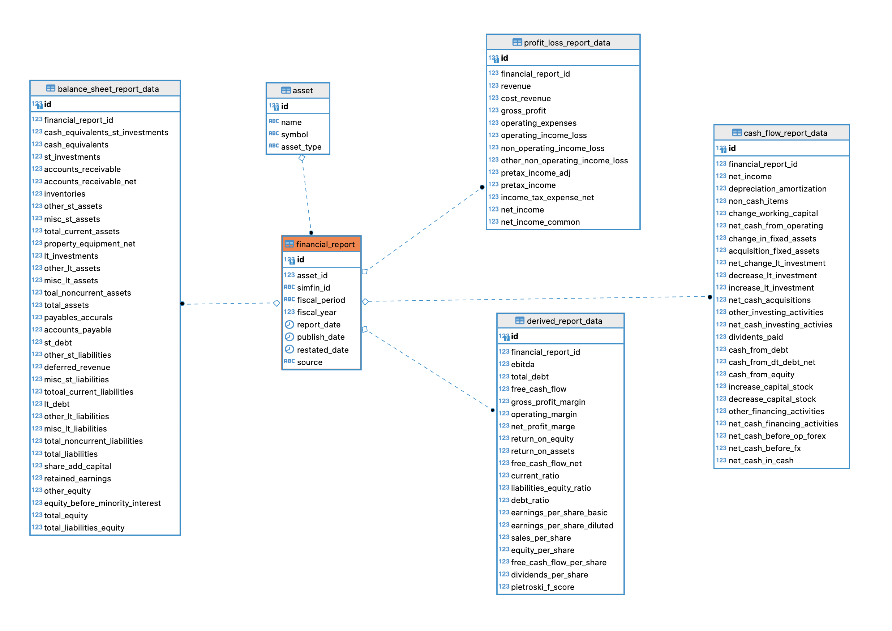

# Stockdata (Udacity Capstone)

This project collects ticker and fundamental data, and offers the consolidated data to compute various signal events for persistence and analysis. For example, a LSTM neural network to detect trade patterns.

Stockdata is a custom Udacity Data Engineering Nanodegree capstone project. As such, it has corresponding requirements:

### Project Scope
* Ticker data is fetched via AlphaVantage, whereas fundamentals data is fetched from SimFin. Minutely data is fetched for minimally 2 years from an list of stock symbols and roughly equates to about 2 million records per stock ticker.
* The end use cases for the organized data is for quantamental (quantitive + fundamental) analysis. This project builds the source of truth tables for the core data, as well as extended dimensions tables for technical indicators.
* On top of data querys for reseach and analysis, the data is normalized to enable the building of a minutely backtester with corresponding fundamental events (i.e. company earnings report).

### Data Cleanup
* Stock price data are missing on non-trading hours (i.e. after-hours, weekends, holidays), which is expected. The source data is already adjusted for dividends and splits so there is no processing required on that front. However, the API returns csv response that would need to be transformed to store in a relational database.
* SimFin API endpoints provide "dimensions table" queries for various reports and such the "fact table" would need to be inferred and upserted. In additional normalizing data formats.
* Some data entries from SimFin are numeric, while some are strings of the numbers, parseing is required for those entries.
* API limitations: Since the free API access level is used for both AlphaVantage and SimFin, various query complexity and bulk limits apply, the ETL process need to detect missing data and batch queries to only the free-tier API spec.

### How to Run

Copy `env.example` to `.env` and populate it with API keys from Alphavantage and SimFin (both are free). Make sure docker is installed on your system.

```
# install pipenv
pip install pipenv --user

# activate the virtual environment
pipenv shell

# install dependencies
pipenv sync

# start docker container for postgres db
docker-compose up -d

# seed the initial list of assets
python stockdata/seed.py

# fetch candlesticks
python stockdata/utils/alphavantage_loader.py

# fetch fundamentals
python stockdata/utils/simfin_loader.py

# run pytest, all cases should pass
pytest
```

### Data Model

Overall Schema


Financial report details


### ETL Pipeline
* DAGs are found under `/dags` folder, airflow will be installed after `pipenv sync` in the local virtual environment. Remember to update dags_folder in airflow.cfg to see the dags.
* `update_candlesticks` is scheduled daily
* `update_fundamentals` is scheduled monthly


### Tech Stack Rationale

Apache Airflow is used to schedule and perform ETL to fetch data from remote sources and keep the data up-to-date. The goal here to gather historical factual data to further analysis, since we want to have flexible queries (for research), a relational database makes sense.

The model was chosen to reflect the nature of the data. I.e. factual occurances for historical prices and financial reports, and additional dimensions of derived data. For example, a star-schema is used for financial reports per company, per quarter.

As the primiary use here is analysis and backtesting (as opposed to live-trading, which would require real-time quotes), a daily update of the pricing data and monthly update of the financial reporting data would suffice to for the use cases.

### Notes on Scaled Scenarios

#### (If the data was increased by 100x.)

We would need to more mindful of the use cases and handle indexing and partitioning to improve performance. However, if the nature of the data increase was a change in the end use case (i.e. from a single-team tools to a service supporting multiple teams), it maybe justify a migration to a NoSQL database like Cassandra.

#### (If the pipelines were run on a daily basis by 7am.)

The pipelines would already be running daily, what's important here is to ensure the ETL script terminates early if no new data is needed, or if the asset list is massive (1000+ tickers), a premium API key would be needed, or better batching of API request would be needed. 

#### (If the database needed to be accessed by 100+ people.)

In this case, we could consider some use case / query optimized tables, or switching to a NoSQL database like Cassandra, and re-design the data model to maximize throughput. The re-modelling in Cassandra would make more sense in conjunction with the data being scaled too, which would mean the project changed from a single-team reseach data bank to a service offered to multiple teams, each with different data usage requirements.